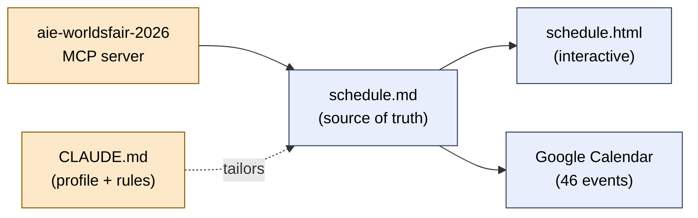

# AI Engineer World's Fair 2026 — My Conference Plan

A personalized, access-filtered schedule for **[AI Engineer World's Fair 2026](https://ai.engineer/worldsfair)**
(June 29 – July 2, 2026 · Moscone West, San Francisco). Built from the official conference data and tuned
to my interests as an AI engineer — then exported to markdown, an interactive web page, and Google Calendar.

## What's in this repo

| File | Purpose |
|------|---------|
| [`aie-wf-2026-schedule.md`](aie-wf-2026-schedule.md) | The plan — one pick + a backup per slot, all 4 days. **Source of truth.** |
| [`aie-wf-2026-schedule.html`](aie-wf-2026-schedule.html) | Self-contained interactive page: day tabs, tap-to-reveal backups, check-off boxes (saved in your browser), Print → PDF. No build step, no network. |
| [`CLAUDE.md`](CLAUDE.md) | Portable planning profile + project guide that Claude Code auto-loads to resume/adjust the plan. |
| [`.mcp.json`](.mcp.json) | Declares the `aie-worldsfair-2026` MCP server (the conference data source). |

## Schedule at a glance

| Day | Theme | Anchor highlight |
|-----|-------|------------------|
| **Mon Jun 29** — Workshops | One deep-dive + hands-on hits | ⭐ *Context Engineering in 2026: Compaction, Memory & Cost* (2 hr) |
| **Tue Jun 30** — Sessions | Coding agents / software factories / retrieval *(lighter, more expo time)* | Dex Horthy: *Why Software Factories Fail* (keynote) |
| **Wed Jul 1** — Sessions ⭐ | Context Engineering + Memory *(strongest day)* | *Lessons from Studying Every Memory System* |
| **Thu Jul 2** — Sessions ⭐ | Agentic + Harness Engineering *(strongest day)* | ⭐ Matt Pocock: *Building Great Agent Skills* (keynote) |

Full details in [`aie-wf-2026-schedule.md`](aie-wf-2026-schedule.md).

## How to use it

- **On a laptop:** open `aie-wf-2026-schedule.html` in any browser. Check sessions off as you go; use the
  **Print** button to save a PDF for the conference floor (WiFi there is unreliable).
- **On your phone:** the plan is already mirrored as **46 Google Calendar events** (Pacific time, color-coded,
  5-min reminders, with each slot's backup pick in the event notes).

## Ticket & access

This plan assumes an **Engineering + Workshops** ticket: full access to workshops, engineering breakout
tracks, Main Stage keynotes, and the expo — but **not** the Leadership track (the *AI-Native Enterprises*,
*CTO Circle*, and *AI Architects* sessions held in the Leadership rooms). Those are filtered out.

## How the pieces fit together

When the plan changes, all three outputs (markdown, HTML, calendar) are kept in sync.

## Updating the plan

Open this folder with **Claude Code** and ask in plain language, e.g. *"swap my Day 3 2:50pm pick to its backup"*
or *"make Day 2 morning the Claude Managed Agents workshop."* It auto-loads [`CLAUDE.md`](CLAUDE.md) for your
profile and the access rules, then updates the markdown, the HTML, and the matching calendar event(s) together.

## Data source

Conference data comes from the official **`aie-worldsfair-2026`** MCP server
(`https://www.ai.engineer/worldsfair/2026/mcp`), configured via [`.mcp.json`](.mcp.json). Some sessions were
marked *tentative* when this plan was built — reconfirm rooms/times on the official app the morning of each day.
